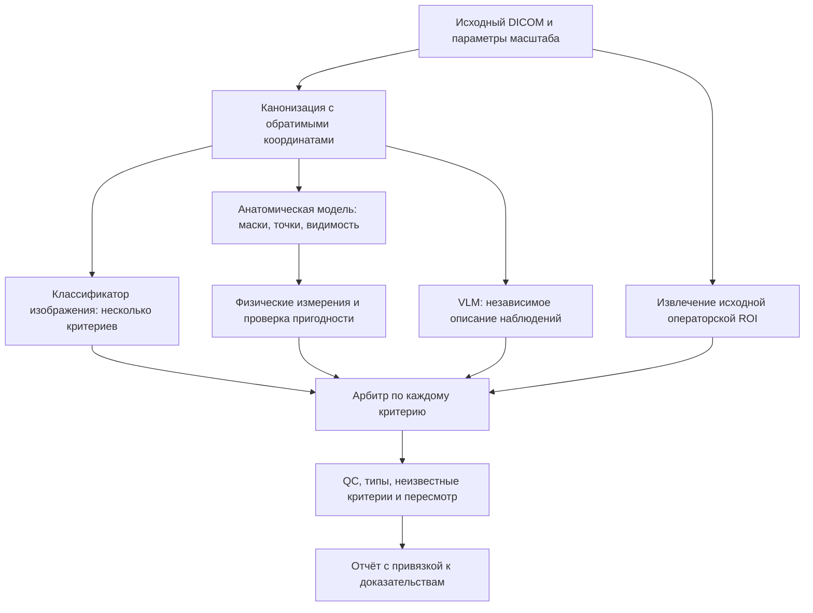

# Консорциум моделей, VLM и открытые решения для DXA QC

Дата поиска: 09.10.2026. Статус: проект экспериментов; новые веса в ходе этого анализа не скачивались и не оценивались на DXA.

Этот документ дополняет [план повышения метрик и команды](METRIC_UPGRADE_AGENT_RUNBOOK_2026_10_09_RU.md), [архитектуру доказательств](EVIDENCE_ENSEMBLE_ARCHITECTURE_2026_10_04_RU.md) и [спецификацию арбитра](ENSEMBLE_IMPLEMENTATION_SPEC_2026_10_04_RU.md).

Продолжение от 10.10.2026: [главная матрица закрытия ТЗ, OCR/LLM и 20 дополнительных экспериментов](FULL_TZ_CLOSURE_AND_METRIC_EXPERIMENTS_2026_10_10_RU.md).

## 1. Что действительно найдено

Среди проверенных первичных источников не найден готовый checkpoint, для которого опубликовано независимое качество одновременно по вашим критериям AP DXA позвоночника и бедра. Это результат данного поиска, не утверждение об отсутствии таких решений во всём интернете.

Доступны сильные компоненты: медицинские VLM, универсальные мультимодальные модели, сегментаторы анатомии, энкодеры и инструменты разметки. Их можно объединить и адаптировать к DXA. Чужой результат на CXR, CT/MRI или whole-body DXA не является вашей метрикой QC.

LLM работает с текстом; VLM — с изображением и текстом; **vLLM — движок инференса**, а не отдельная медицинская модель. Более быстрый vLLM сам по себе не повышает точность. Открытый код, доступные веса и разрешение на применение — разные свойства.

## 2. Какие модели проверять

| Кандидат и первичный источник | Что доступно | Предлагаемая роль | Ограничение и приоритет |
|---|---|---|---|
| [MedGemma 1.5 4B](https://huggingface.co/google/medgemma-1.5-4b-it) | Медицинская модель изображения+текст с весами; условия HAI-DEF | Дополнительный эксперт: структурированное описание дефекта и основания пересмотра | P1 для пилота VLM; качество DXA QC не подтверждено |
| [Qwen3.5-9B](https://huggingface.co/Qwen/Qwen3.5-9B) | Мультимодальные веса, Apache-2.0 | Второй VLM для сравнения наблюдений и извлечения видимой информации | P1 для пилота; общая модель, DXA-критерии требуют проверки |
| [Qwen3-VL-8B-Instruct](https://huggingface.co/Qwen/Qwen3-VL-8B-Instruct) | Мультимодальные веса, Apache-2.0 | Резервный кандидат для того же протокола | Не добавлять как третий голос без проверки дополнительной пользы |
| [FleXray](https://huggingface.co/VictorButoi/flexray) | Сегментационные веса, несколько участников ансамбля; CC BY-NC 4.0 | Маски позвонков, бедренных и тазовых костей | P1 для исследовательского переноса на DXA; ограничение NC существенно для продуктового использования |
| [MedSAM / LiteMedSAM](https://github.com/bowang-lab/MedSAM) | Код и медицинские сегментационные веса | Ускорить экспертную разметку по подсказке прямоугольником | P0/P1 для создания эталонов; автоматические маски требуют проверки |
| [MedSAM2](https://github.com/bowang-lab/MedSAM2) | Код и веса для медицинских объёмов и видео | Дополнительный исследовательский сегментатор при подходящем входе | Не считать автоматически лучшим выбором для одиночного 2D DXA |
| [SAM 3](https://github.com/facebookresearch/sam3) | Код, обучение и ссылки на веса; собственная SAM License | Кандидат для разметки и сегментации по подсказкам | P2: универсальная модель, перенос на DXA нужно измерить |
| [DINOv3-B](https://huggingface.co/facebook/dinov3-vitb16-pretrain-lvd1689m) и [MedSigLIP](https://huggingface.co/google/medsiglip-448) | Энкодеры с открытыми весами на условиях владельцев | Обучаемые головы анатомии и QC | Уже обсуждены и частично исследованы в проекте; использовать с новой задачей/данными |
| [RadGrounder](https://github.com/lmb-freiburg/radgrounder), [карточка весов](https://huggingface.co/lmb-freiburg/radgrounder) | Описаны модели с bounding boxes и масками для CT/MR | Изучить устройство связи текста с локализацией | P2: другой домен; README и карточка расходятся по статусу доступа, есть NC-условия; проверить доступ и лицензию до загрузки |
| [LeDXA](https://arxiv.org/abs/2608.02208) | Публикация самообучения на whole-body DXA | Методическая основа адаптации представлений к DXA | Готовый общедоступный QC-checkpoint не подтверждён этим поиском |

MedGemma использует медицинский визуальный энкодер семейства MedSigLIP. Поэтому их выводы могут иметь общие ошибки; это не два гарантированно независимых источника. Это архитектурное основание для проверки зависимости ошибок, а не измеренная корреляция на нашем наборе.

### Уже имеющиеся компоненты

- `competition/flexray_candidate.py` содержит закреплённый ONNX-адаптер одного участника FleXray (`flux0375`) с проверкой файлов и предобработки. Он не меняет QC автоматически.
- Согласно прежнему обзору, LiteMedSAM и малые DAX-веса уже загружались. Проверить фактическое наличие на машине; Git не переносит большие активы.
- [DXA-to-3D](https://github.com/EmmanuelleB985/DXA-to-3D) уже изучался: локальный отчёт описывает конечный вектор формы без подтверждённого соответствия вашим QC-меткам. Не скачивать повторно как якобы готовое решение оси.
- Не подменять AP DXA латеральной VFA, whole-body, обычным рентгеном или CT. Использовать их как pretraining можно только с отдельной оценкой переноса.

## 3. Как должен работать консорциум

Начать с **трёх основных источников и одного экспериментального VLM**, а не с десятка разговорных агентов.



Это проект потока, пока не реализованный новый production-профиль.

### Участники и их ответственность

1. **Классификатор:** вероятность каждого дефекта по пикселям. Выходы multi-label, а не взаимоисключающие классы.
2. **Анатомический эксперт:** структуры, ориентиры и видимость. Вычисляет, можно ли вообще измерять заданный признак.
3. **Измеритель:** угол и расстояния по пригодным ориентирам, в мм/градусах, с источником масштаба и ошибкой измерения.
4. **VLM:** перечисляет видимые наблюдения, предлагает область проверки и может сообщить «неоценимо». Сначала работает без влияния на вердикт.
5. **Экстрактор ROI:** получает реальную операторскую ROI из поддерживаемого источника. Предложенная моделью ROI не заменяет исходную.

Геометрия, полученная из масок анатомического эксперта, зависит от него. Несколько crop, TTA и разных промптов одного VLM тоже не становятся независимыми голосами. Арбитр должен учитывать семейство и происхождение доказательства.

### Объединять отдельно по критериям

| Критерий | Основное основание | Дополнительная проверка |
|---|---|---|
| Ось позвоночника | Экспертно определённые ориентиры и физический угол | VLM/классификатор фиксирует конфликт; не меняет угол словесным ответом |
| Охват позвоночника | Видимость Th12/уровней/гребней, граница действительного кадра | Полный кадр и дополнительный VLM-ответ |
| Артефакт | Обучаемый детектор/классификатор с локализацией | Проверка анатомического перекрытия и VLM-наблюдение |
| Ротация бедра | Анатомия малого вертела/шейки и обученная голова | Глобальные признаки и описание VLM |
| Ошибка исходной ROI | Извлечённая операторская ROI относительно анатомии | При отсутствии ROI — `unknown` |

На старом внутреннем аудите большинство трёх участников дало F1 около **0,553**, а геометрический RF — **0,575**. Объединение при любом положительном голосе повысило чувствительность ценой большого количества FP. Поэтому нельзя ожидать улучшения от самого факта голосования. См. [аудит разнообразия ошибок](competition/ensemble_diversity_2026_10_04.json).

Начальный арбитр — регуляризованная логистическая модель на небольшом наборе признаков: scores критериев, доступность экспертов, пригодность измерения и признаки конфликтов. Сравнить с простым средним. Сложный mixture-of-experts оставить на этап, когда данных достаточно и простой вариант уже измерен.

## 4. Как проверить VLM без самообмана

1. Создать пилот из 50–100 размеченных исследований для разработки протокола. Это dev-набор, его результаты не объявлять независимым тестом.
2. Сделать новый тест по пациентам; объём определять числом позитивов каждого критерия, а не числом картинок вообще.
3. Первым запросом подавать исходный канонизированный кадр без вывода другой модели и без анатомического overlay. Иначе VLM может просто повторить чужую ошибку.
4. Отдельной абляцией добавить обзорный кадр + один crop, всегда сохраняя преобразование координат. Для охвата полный кадр обязателен.
5. Разделить запрос по критериям; ограничить число повторов и зафиксировать промпт до теста.
6. Не подставлять BMD, T-score, диагноз и экспертные надписи как shortcuts для оценки укладки. Сравнить допустимые представления с отчётными наложениями и без них; не стирать ROI, если именно она нужна критерию.
7. Измерить parsing failures, галлюцинации структур, ошибочную уверенность, FN/FP, покрытие, время и дополнительную пользу поверх существующего pipeline.
8. JSON Schema гарантирует форму ответа, но не его медицинскую истинность. Вероятность, написанная самим VLM, не считается калиброванной `quality_prob`.
9. Если VLM выдаёт координаты, проверить локализацию на экспертных точках/масках; преобразовать координаты в исходный кадр. Угол и мм считать отдельным кодом.
10. Промпт и few-shot-примеры выбирать только на train/dev. Подбор текста запроса — тоже обучение с точки зрения утечки.

Начальная схема ответа:

```json
{
  "criterion": "spine_coverage",
  "observation": "unknown",
  "visible_evidence": [],
  "not_assessable_reason": "structure visibility is insufficient"
}
```

Для `observation` разрешить только `suspected_defect`, `no_visible_defect`, `unknown`. Числа, единицы и координаты добавить после отдельной проверки способности их извлекать. Фраза «не вижу дефект» не разрешает автоматический допуск при непроверенных обязательных критериях.

### Минимальная матрица экспериментов

| Вариант | Какой вопрос проверяет |
|---|---|
| E0: текущий pipeline | Контрольный результат |
| E1: E0 + исправленная анатомия/геометрия | Устранили ли ошибки измерений? |
| E2: MedGemma самостоятельно | Есть ли сигнал по нашим критериям? |
| E3: Qwen3.5 самостоятельно | Есть ли более полезные наблюдения? |
| E4: E1 + один заранее выбранный VLM | Добавляет ли VLM информацию? |
| E5: E4 + второй VLM | Окупается ли второй эксперт? |
| E6: компактная модель после дистилляции | Можно ли сохранить качество с меньшим временем? |

Сначала исследовать укладку/ротацию бедра: там больше позитивов. Редкие критерии расширять до сложного stacking. Все уровни арбитра и порогов строить внутри train внешнего фолда, как описано в существующей спецификации. Считать парные интервалы и общие FN, а не только согласие моделей.

## 5. Команды для локального пилота VLM

Запуск нового окружения/моделей здесь не выполнялся. Это команды подготовки на машине с подходящим NVIDIA GPU; перед полным запуском нужны проверка версии, официального доступа и smoke-test изображения.

vLLM устанавливать отдельно от `.venv-gpu`: он может требовать другую версию PyTorch/CUDA. Существующие закреплённые исследовательские зависимости не гарантируют поддержку нового VLM.

```bash
uv venv .venv-vlm --python 3.11
uv pip install --python .venv-vlm/bin/python vllm huggingface-hub
mkdir -p data/vlm-environment
uv pip freeze --python .venv-vlm/bin/python > data/vlm-environment/requirements-resolved.txt
```

После проверки совместимости закрепить фактические версии и revisions моделей. Не считать установка без пинов воспроизводимым окончательным окружением.

```bash
.venv-vlm/bin/hf download google/medgemma-1.5-4b-it \
  --local-dir data/vlm-models/medgemma15

.venv-vlm/bin/hf download Qwen/Qwen3.5-9B \
  --local-dir data/vlm-models/qwen35-9b
```

MedGemma требует принятия условий владельца. Сохранить revision, SHA-256 файлов, процессор и chat template. Для последующих загрузок использовать выбранный `--revision`. Не записывать токены в логи.

Первый сервер, в отдельном терминале:

```bash
.venv-vlm/bin/vllm serve data/vlm-models/medgemma15 \
  --served-model-name medgemma-dxa-research \
  --host 127.0.0.1 \
  --port 8015 \
  --max-model-len 4096 \
  --gpu-memory-utilization 0.8
```

Для сравнения остановить первый сервер и запустить второй, если памяти на совместную загрузку недостаточно:

```bash
.venv-vlm/bin/vllm serve data/vlm-models/qwen35-9b \
  --served-model-name qwen-dxa-research \
  --host 127.0.0.1 \
  --port 8016 \
  --max-model-len 4096 \
  --reasoning-parser qwen3 \
  --gpu-memory-utilization 0.8
```

Официальная [карточка Qwen3.5](https://huggingface.co/Qwen/Qwen3.5-9B) описывает vLLM-рецепт; [список поддерживаемых моделей vLLM](https://docs.vllm.ai/en/latest/models/supported_models/) нужно сверять с установленной версией. Ограничение 4096 — стартовая настройка нашего пилота, её достаточность проверить по реальному количеству изображений/токенов. Не включать text-only режим для оценки снимков.

Клиентский адаптер ещё требуется реализовать: отправлять подготовленное локальное изображение как base64 data URL в `/v1/chat/completions`, явно задавать модель, лимит ответа и схему JSON; проверять HTTP-ошибки, timeout и отказ парсинга. Не отправлять DICOM как неподдерживаемый image payload.

Для современного vLLM JSON-ограничение задаётся через `structured_outputs` (в extra body клиента), а не устаревшее `guided_json`. Для Qwen в non-thinking абляции использовать `chat_template_kwargs: {"enable_thinking": false}` и сохранить это в конфигурации. См. [официальную документацию structured outputs](https://docs.vllm.ai/en/latest/features/structured_outputs/).

Для памяти: BF16-веса номинально требуют порядка 2 байт на параметр — около 8 ГБ для 4B и 18 ГБ для 9B. Это нижний ориентир только весов; энкодер, KV cache, служебные буферы и batching требуют дополнительной памяти. Не обещать совместную загрузку на GPU заданного размера без измерения. Квантизацию сравнить с BF16 отдельно.

## 6. Как проработать проект сильнее без бесконечного перебора

### Active learning

Набирать train-разметку из четырёх очередей: расхождение экспертов, пограничные измерения, редкие реальные дефекты и случайные снимки обычного потока. Сохранять причину выбора. Тест собирать независимо от этой очереди, иначе prevalence и сложность будут искусственно изменены.

### Адаптация и multitask

На Chinese DXA проверить domain-adaptive self-supervised обучение заранее выбранного энкодера, затем головы анатомии и критериев. Сравнить с исходным энкодером на одинаковой разметке. SSL без дефектных меток не гарантирует распознавание дефектов. Исключить будущий test из предобучения при inductive-протоколе.

Обучать совместно точки, маски и дефекты только там, где есть подтверждённые ответы. Маскировать неизвестные targets. Учитывать аппарат/проекцию, не позволять модели классифицировать источник вместо нарушения.

### Teacher–student

Ансамбль/VLM может предложить псевдометки для train. Сохранить источник, не смешивать их с экспертным эталоном, проверить фильтрацию на gold-dev. После измеренной пользы обучить компактного ученика и проверить его самостоятельно: дистилляция переносит также ошибки учителя.

### Надёжность измерений

Проверить поворот, фотометрию, анизотропный масштаб, crop, имплантат, наложения и неизвестную проекцию. Поворот/обрезка могут менять настоящую метку — не применять ко всем изображениям универсальное правило «ответ должен остаться прежним». Публиковать coverage и риск среди автоматически принятых случаев.

## 7. Если под консорциумом понимать клиники и специалистов

Это потенциально более сильный следующий шаг, чем дополнительные голоса моделей. Предлагаемый пилот: 2–3 центра, по возможности GE и Hologic, два разметчика контрольной части и третий эксперт для разрешения разногласий.

1. Единый справочник критериев, точки/маски, операторская ROI, видимость и причины `unknown`.
2. Псевдонимизированные ключи пациента, исследования, центра и аппарата для разбиения.
3. Версионное хранение обеих исходных оценок и итогового ответа; проверить межэкспертное согласие.
4. Общий учебный корпус, а также полностью удержанный центр и более поздний временной период для теста.
5. Реальные редкие дефекты плюс отдельный обычный поток; учитывать происхождение выборки.
6. При невозможности объединить данные начать с общего evaluator и локального теста фиксированной модели в каждом центре. Федеративное обучение добавлять после простого проверенного протокола, а не первым этапом.

Ни один центр или специалист в ходе этой работы не привлечён; обращения и соглашения не выполнялись. Этот раздел — предложение организации данных.

## 8. Дополнение к заданию другому агенту

> Прочитай этот документ и прежний runbook. Не запускай все модели сразу. Проверь актуальность официальных checkpoints, их условий, версии vLLM и уже скачанных активов. Подготовь отдельное VLM-окружение и клиентский адаптер с локальными изображениями и проверяемым JSON.
>
> Сначала сравни MedGemma 1.5 4B и Qwen3.5-9B на train/dev по одним критериям без подсказок текущего pipeline. Зафиксируй промпты, transforms, revisions, latency, parsing failures и FN/FP. Самооценку уверенности VLM не выдавай за калиброванную вероятность.
>
> Оцени существующий FleXray-адаптер на экспертных масках. Полный ансамбль и TTA проверяй только после одиночного baseline; исходный ONNX-адаптер не реализует полный ансамбль. Предел времени и число проходов учитывать в сравнении.
>
> После доказанной дополнительной пользы подготовь арбитр по критериям с честным вложенным обучением и режимом наблюдения. Не устраивай бесконечные дискуссии LLM, не считай разные промпты независимыми экспертами и не заменяй медицинский эталон голосованием. Итоговый эффект проверь один раз на заранее замороженном новом тесте.

Критерий успеха: измеренный прирост заранее выбранных сквозных показателей, объяснимое уменьшение конкретных ошибок и приемлемое время полного исследования. Красивое описание VLM и высокий benchmark в другой модальности этим результатом не являются.
